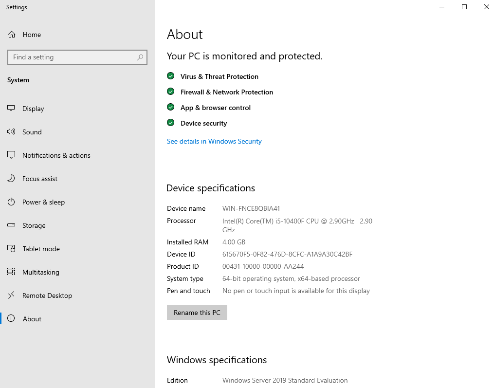
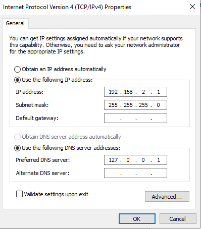
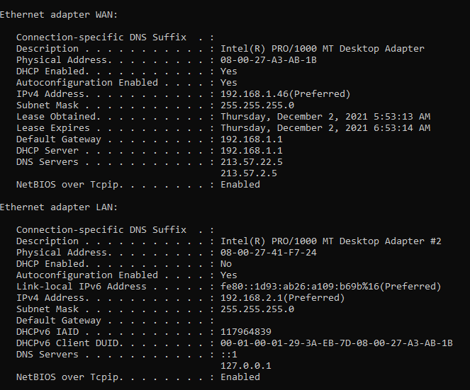

## Setting up an Active Directory Environment

**After setting up Windows Server 2019, the next phase is creating an Active Directory environment.**

**1. Changing the system's name.**  
**2. Configuring the LAN Network Interface Controller (NIC).**  
**3. Installing the Active Directory Domain Services (AD DS) role.**  
**4. Promoting the server to a Domain Controller (DC).**  

## Changing the system's name

Right click on 'Windows Start' and click on 'System'
This should lead to the following picture

Then click on 'Rename this PC' and choose a name for the system.

## Configuring the LAN interface

To configure the LAN Network Interface Controller (NIC), enter the 'Control Panel' -> 'Network and Internet' -> 'Network and Sharing Center
Click on 'Change adapter settings' on the left bar.

You will see 2 NICs now, one is the WAN interface and the other is for the internal network (LAN).
After finding out which interface is WAN and which is LAN, change their names so you could differ one from another.
Then go to the LAN interface settings and configure it, my configurations are:

The default gateway is left empty because the Domain Controller is the default gateway.

This is how both the NICs properties look, As you can see the WAN interface gets a lease by the DHCP, while the LAN isn't.

## Installing the Active Directory Domain Services (AD DS) role

## Promoting the server to a Domain Controller (DC)
