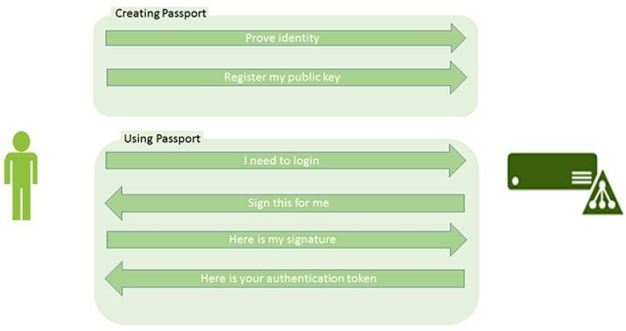
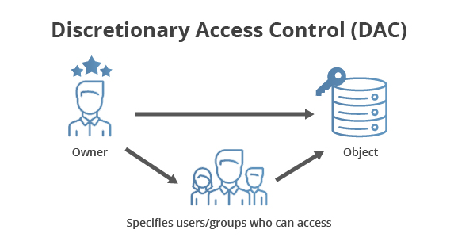

# Introduction
- [Windows Server Features](#windows-server-features)
   - [Dynamic Host Configuration Protocol (DHCP)](#dynamic-host-configuration-protocol-dhcp)
   - [Domain Name System (DNS)](#Domain-Name-System-dns)
   - [Hyper-V](#Hyper-V)
   - [Internet Information Services (IIS)](#Internet-Information-Services-IIS)
   - [IP Address Management (IPAM)](#Internet-Protocol-Address-Management-IPAM)
   - [Network Time Protocol (NTP)](#Network-Time-Protocol-NTP)
   - [Remote Access](#Remote-Access)
   - [Preboot Execution Environment (PXE)](#Preboot-Execution-Environment-PXE)
- [Directory Services](#Directory-Services)
- [Lightweight Directory Access Protocol (LDAP)](#Lightweight-Directory-Access-Protocol-LDAP)
- [Kerberos](#Kerberos)
- [Active Directory Features](#Active-Directory-Features)
  - [Single Sign-On (SSO)](#Single-Sign-On-SSO)
  - [Microsoft Passport](#Microsoft-Passport)
  - [Replications](#Replications)
  - [Auditing](#Auditing)
  - [Security](#Security)
- [Active Directory Domain Services](#Active-Directory-Domain-Services)
  - [Domain](#Domain)
  - [Domain Tree](#Domain-Tree)
  - [Forest](#Forest)
  - [Domain Design/Models](#Domain-DesignModels)
    - [Single Domain Model](#Single-Domain-Model)
    - [Regional Domain Model](#Regional-Domain-Model)
  - [Forest Design/Models](#Forest-DesignModels)
    - [Single Forest](#Single-Forest)
    - [Multiple Forest](#Multiple-Forest)
    - [Organizational Forest Model](#Organizational-Forest-Model)
    - [Resource Forest Model](#Resource-Forest-Model)
    - [Restricted Access Forest Model](#Restricted-Access-Forest-Model)
   - [Security Identifiers (SID) and Globally Unique Identifiers (GUID)](#Security-Identifiers-SID-and-Globally-Unique-Identifiers-GUID)
   - [Trusts](#Trusts)
     - [Forest Trusts](#Forest-Trusts)
   - [Domain Controller (DC)](#Domain-Controller-DC)
     - [Global Catalog (GC)](#Global-Catalog-GC)
     - [Read Only Domain Controller (RODC)](#Read-Only-Domain-Controller-RODC)
   - [Organizational Unit (OU), Container, Leaf](#Organizatinal-Unit-OU-Container-Leaf)
   - [Organizational Unit (OU) and Container Models](#Organizational-Unit-OU-and-Container-Models)
     - [The Container Model](#The-Container-Model)
     - [The Geographical Model](#The-Geographical-Model)
     - [The Object-Based Model](#The-Object-Based-Model)
     - [The Division/Department Model](#The-DivisionDepartment-Model)
     - [Hybrid Models](#Hybrid-Models)
   - [Replication](#Replication)
     - [Site](#Site)
     - [Intra-Site Replications](#Intra-Site-Replications)
     - [Inter-Site Replications](#Inter-Site-Replications)
     - [Knowledge Consistency Checker (KCC)](#Knowledge-Consistency-Checker-KCC)
   - [Failover Clustering](#Failover-Clustering)
   - [Flexible Single Master Operation (FSMO)](#Flexible-Single-Master-Operation-FSMO)
     - [Domain Level Roles](#Domain-Level-roles)
       - [Primary Domain Controller (PDC)](#Primary-Domain-Controller-PDC-Emulator)
       - [Relative Identifier (RID)](#Relative-Identifier-RID-Master)
       - [Infrastructure Master](#Infrastructure-Master)
     - [Forest Level Roles](#Forest-Level-roles)
       - [Schema Operations Master](#Schema-Operations-Master)
       - [Domain Naming Master](#Domain-Naming-Master)
     - [Flexible Single Master Operation (FSMO) Failover](#Flexible-Single-Master-Operation-FSMO-Failover)
- [Miscellaneous](#Miscellaneous)
- [Group Policy](#Group-Policy)
- [Active Directory Planning](#Active-Directory-Planning)
- [Managing Active Directory Objects](#Managing-Active-Directory-Objects)
  - [Managing Users](#Managing-Users)
  - [Managing Computers](#Managing-Computers)
- [Active Directory Lightweight Directory Services (AD LDS)](#Active-Directory-Lightweight-Directory-Services-AD-LDS)
- [Active Directory Federation Services (AD FS)](#Active-Directory-Federation-Services-AD-FS)
- [Active Directory Certificate Services (AD CS)](#Active-Directory-Certificate-Services-AD-CS)
- [Active Directory Rights Management Services (AD RMS)](#Active-Directory-Rights-Management-Services-AD-RMS)
- [Azure Active Directory](#Azure-Active-Directory)
- [Bibliography](#Bibliography)

# Windows Server Features
A brief explanation of some of the technologies Windows Server provides, some were used in the making of an Active Directory environment I will show.

### Dynamic Host Configuration Protocol (DHCP)
A Dynamic Host Configuration Protocol (DHCP) server provides an IP address, subnet mask, default gateway and other properties (scope) to a host. A DHCP Server could be deployed on a Domain Controller (DC) inside an Active Directory (AD) environment on a Windows Server OS (Operating System), or a standalone computer.  
*DHCP can assign IPv6 as well as IPv4, but the use of IPv6 is less common.*

DHCP assigns IP addresses automatically, this comes very helpful in vast organizations, each client (computer) requires a unique IP. Configuring and assigning IP addresses manually could be impossible to maintain and manage and would consume astronomical resources from the organization. Active Directory Domain Services (AD DS) requires clients to be connected to the network, hence a DHCP in most Active Directory environments.

DHCP manages the entire process, it stores a pool of IP addresses and leases them to clients. Occasionally, the DHCP re-assigns IP addresses to the clients. DHCP allows reservations, this comes handy in the Active Directory environment because of the many servers, reservations ensures that clients/servers always receive the same specific IP address.
Once an IP is assigned by the DHCP Server, the client assigned with the IP is the only client that can be assigned with that IP for the duration of the lease.

*Example: a WI-FI coffee shop, would have to change the default schedule time for re-leasing IP addresses or otherwise no customers would be able to connect to the WI-FI after the whole pool has been used by ongoing customers, the IT administrators might schedule the re-leasing to every couple of hours or so, due to the fast-changing clients. In an office the schedule would occur less frequently.*

### Domain Name System (DNS)
Domain Name System (DNS) could be viewed as the phonebook of the Internet. It was built on the assumption that users/people are better in remembering names rather than numbers. 
DNS translates host names to IP addresses and vice versa. A DNS Server can be deployed on a domain controller on a Windows Server OS (Operating System), as well as a standalone computer.

### Hyper-V
Hyper-V is Microsoft’s virtualization platform that could be implemented into Windows Server, as well as Windows 10. Hyper-V allows running multiple virtual operating systems on a single workstation, Hyper-V also allows creating virtual devices such as switches, network virtualization, and virtual machine encrypted networks.  
Virtualization can be very resourceful as it allows running old applications on older operating systems, test software, upgrades and new configurations, and run different operating systems.

*Nested virtualization allows Hyper-V to run inside of a virtual machine operating system, this feature requires hardware prerequisites.*

### Internet Information Services (IIS)
Microsoft’s Internet Information Services (IIS) is a GUI application for managing a web server, in some documentation it’s called '*Windows Web Server*'. Some organizations use IIS for both their intranet services as well as their public ones, it’s possible to manage up to 10,000 sites from a single Windows Server OS (Operating System) that has IIS deployed on.  
IIS helps in configuring both basic and advanced configurations such as: setting up new websites, virtual directories, and configuring TLS certificates.

### Internet Protocol Address Management (IPAM)
Internet Protocol Address Management (IPAM) allows to manage both DHCP and DNS Servers in a centralized way, an IPAM Server can manage up to 150 DHCP Servers ,500 DNS Servers, 6000 different DHCP scopes and 150 DNS zones. All of these servers and configurations can be managed from a single console thanks to IPAM.  
Deploying IPAM is only possible on a computer inside the Active Directory forest, and it is possible to have more than one in a forest. IPAM cannot be deployed on a domain controller or a server that already hosts DHCP or DNS. IPAM uses a process called ‘*Server Discovery*’ which locates domain controllers, DNS servers, and DHCP servers. This feature comes in handy in large networks as it eliminates manual labor.

### Network Time Protocol (NTP)
Network Time Protocol )NTP) is designed for the purpose of synchronizing clocks of computers in a network to a common time, in most cases it’s UTC.  
As convenient as having all the network’s computers clocks synchronized and updated with the ‘right’ time, it’s a very important aspect in systems/protocols. Having a synchronized time is required for Kerberos, forensics, and time-based transactions to work properly. Regulations demand the time synchronization to have an accuracy of 200ms (milliseconds) or better.  
Network Time Protocol uses UDP to transfer data, this is due to the fast connection setup and response times UDP provides. The port number the protocol uses for listening and advertising is 123.

### Remote Access
Remote Access is the name given for the following topics: Remote Access Service (RAS), Routing, and Web Application Proxy (WAP). Some of the uses of these technologies are remote access, site-to-site connectivity, Network Address Translation (NAT), and Virtual Private Network (VPN).

RAS allows for users to connect to the RAS server through the WAN, but access resources as if they were logged from the LAN.  
Routing is used to move network traffic between different broadcast domains on the LAN, routing supports NAT, which allows transferring requests to specific locations.  
WAP allows to users outside of the LAN to access web applications, for WAP to work, it requires Active Directory Federation Services (AD FS). WAP gives the ability to authenticate identities before granting access to web applications.

### Preboot Execution Environment (PXE)
PXE environment is the process of having devices boot from network, rather from the computer’s hard disk, PXE isn’t common in organizations.  
PXE could use a DHCP server to boot, this could be done in the DHCP configurations.  
Booting from the network could be problematic, if there are issues in the inner network, then you might not be able to use your computer, it also causes network traffic over the LAN network.

# Directory Services
Directory services are network-based services, it organizes, and stores information about the enterprise and the users. Directory services are also a collection of processes that runs applications for the enterprise, access control, and other resources as well as resources planning. 

Directory services information can be distributed among many different computers, but performing searches and maintenance is done on a single database. Directory services allows accessing information from different computers that are connected to the directory services as well as different operating systems. Directory services supports a hierarchical naming model, make searches, and replications.

### X.500
X.500 is a series of standards/recommendations that defines a directory service.

# Lightweight Directory Access Protocol (LDAP)
Lightweight Directory Access Protocol (LDAP) is an open protocol used to query and modify objects in Active Directory and other directory services that supports the use of LDAP. 
LDAP was supposed to be the ‘bridge’ between X.500 (international directory services standard) and Internet applications. LDAP only allows to do limited amount of operating, that are basic.

LDAP session starts when a client connects the LDAP server, an LDAP server is called Directory System Agent (DSA). LDAP communicates on port 389 for both TCP and UD, and on port 636 for LDAPS, the client then may query and modify using basic operations.

# Kerberos
Active Directory uses the Kerberos protocol for its authentication protocol, and therefore the following explanation will provide information related to Active Directory (Kerberos is implemented in other OSs, such as Red Hat, FreeBSD, and Mac OS X). The Kerberos environment is called the ‘Kerberos realm’, and it consists of 3 main parts: users/clients, trusted authority (KDC), and a server.

The Kerberos realm is a logical set of objects, the boundary of the realm is the master KDC. Much like an Active Directory forest, realms can be hierarchical (parent-child relationship) or non-hierarchical, Kerberos supports authentication across realms, it’s called ‘cross-realm authentication’. To perform the cross-realm authentication, a KDC needs to hold other KDC principal entry.  
Kerberos uses symmetric encryption, and Key Distribution Center for authenticating.  

Key Distribution Center (KDC) is part of the domain, it’s located on the **Domain Controller (DC)**. KDC is a process that performs **Authentication Service (AS)** and **Ticket-Granting Service (TGS)**, it also uses Domain Controllers and Global Catalogs databases for its services.

Both the user and the KDC (Domain Controller) holds the required credentials of the user account. When the user logs in, the username is sent to the Authentication Service among other data, including the destination, and the IP. The Authentication Service digests a hash combined of the user’s password, ‘Salt’, and the key version number, the hash is also called the ‘Client Secret Key’ or the user’s ‘Long-Term Key’. Since both the user and the KDC can digest the user’s Long-Term Key, it’s used as the symmetric key. The user’s Long-Term Key is used to encrypt a message that includes the Ticket-Granting Service (TGS) ID, timestamp, lifetime, and the TGS session key. This message is sent to the user.  
The other message that’s sent is the Ticket Granting Ticket (TGT), it includes some attributes as well as the TGS Session Key that is encrypted with the KDC’s Long-Term Key. The user cannot decrypt the TGT since he doesn’t know the KDC’s Long-Term Key. 

The user sends his own timestamp along with the user ID and encrypts it with the TGS Session Key, the user also sends a message that holds information about the wanted service from the server. The TGT is sent back along with the other messages to the KDC.

The TGS decrypts the messages, holding both required keys, and compares them with the TGS database. If the data is identical and the timestamp is within a 5-minute timeframe it proves it’s genuine. The TGS adds the user information to its database (cache).

The TGS sends the user a message containing information and the Server Session Key for the required server, encrypted with the TGS Session Key provided before.  

The TGS also sends the user the Server Ticket encrypted with the server’s Long-Term Key, which cannot be decrypted by the user, it’s sent to the server.   
The user sends the server his own timestamp along with the user ID and encrypts it with the Server Session Key.  

The server decrypts the messages and compares the information and the timestamp just like the TGS did before and adds the user’s information to its database (cache).  
In the end, the server sends the server ID and timestamp back to the user encrypted with the Server Session Key, which becomes the symmetric key. The user then checks the information and adds it to its database (cache).  

Source: Wikipedia  

The Kerberos realm is a logical set of objects, the boundary of the realm is the master KDC. Much like Directory Services, realms can be hierarchical (parent-child relationship) or non-hierarchical, Kerberos supports authentication across realms, it’s called ‘cross-realm authentication’. To perform the cross-realm authentication, a KDC needs to hold other KDC principal entry.

# Active Directory
Active Directory is the leading LDAP directory service solution made by Microsoft. It was first introduced in Windows 2000 Server edition as an implementation of X.500 directory.
Active Directory uses LDAP as its primary access protocol. Active Directory stores information about a variety of objects in the network such as user accounts, computer accounts, and groups in databases called Domain Controller (DC). Active Directory uses the Kerberos protocol for authentication. 

Active Directory Domain Services (AD DS) is the main directory services product. While Active Directory Lightweight Directory Services (AD LDS) is the lightweight version of the Active Directory Domain Services product, it can be used for other purposes (migrating).  
Microsoft has introduced Azure Active Directory, which is an off-premise (cloud) directory services product, it’s different from the Active Directory Domain Services (AD DS)  product.  

Active Directory Federation Services (AD FS), Active Directory Rights Management Services (AD RMS), and Active Directory Certificate Services (AD CS) are products that can be deployed on top of the Active Directory Domain Services, as they provide services that perform a higher secure environment.

# Active Directory Features
## Single Sign-On (SSO)
There are many applications that require authentications from the user, sometimes different authentication methods. This can be both time consuming for user and I.T and a security problem, a common security problem is having users writing down their passwords on notes around the office due to one too many passwords to remember for each application.  
Single Sign-On as implied, requires the user to log in with a single user-ID and password for the whole session, Active Directory will provide the credentials needed for any further logins. Hence, the user won’t need to keep typing his credentials to get access.

## Microsoft Passport
Microsoft Passport allows a better single sign on authentication. Microsoft Passport service could be implemented on Active Directory to allow users a more private and secure log ins. Microsoft Passport uses different methods to reduce reliance on passwords, this is done through multi-factor authentication, one-time passwords, and complex policies. 
Microsoft Passport requires the users to first prove their identity and create a gesture they will use upon entering the system, logging in. This gesture could be a pin, or biometric identification of some sort.

Source: https://techcommunity.microsoft.com/t5/image/serverpage/image-id/45719i9A14C684BBB3FAAD

### Trusted Platform Module (TPM)
TPM provides a hardware-based, computer chip, that securely stores artifacts used for authentication, it could be passwords, RSA keys, and other sensitive information.

## Replications
Active Directory could be implemented in small/centered organizations as well as vast organizations with many sites. The more complex organizations require multiple Domain Controllers, therefore it’s important for the Domain Controllers to maintain updated data throughout the sites. Active Directory maps the IP addresses of each site, this is done using the Subnet Mask.  
The replication is managed by the Knowledge Consistency Checker (KCC), a process that runs on the Domain Controllers and generates replication topology for the Active Directory forest.  
Identifying the organization’s needs and making an effective topology is crucial for the network’s performance.

## Auditing
Auditing helps to maintain regulatory compliance and the organization’s security. Auditing in Active Directory uses policies to store events, as with many Active Directory aspects this too can be a two-edges sword as the administrators would have to prioritize some events over others, policies cannot be too broad or too narrow.  
Auditing could be used in forensic analysis and in detecting anomalous behavior.

## Security
Active Directory stores in its databases vast amounts of information about the organization’s employees, this calls for protection.  
Active Directory supports various authentication methods, group policies and practices to use against threats, these solutions should be implemented by administrators, but must be followed by the employees. Administrators need to recruit the users for the task, while maintaining the group policies as well as updating the system.

# Active Directory Domain Services 
As stated before, this repository will introduce Active Directory through it’s fullest products which is Active Directory Domain Services

## Domain
Domain refers to a collection of both logical and physical objects (users/computers/printers), each object has a unique identity, and a set of privileges that are administrated to follow the rules posed by the administrator. The domain can be viewed as a security boundary for the objects inside it, using different policies to maintain the organization’s security.
Domains differ from one to another by the domain identifiers (name, IP, physical hardware). Every domain has a different given name, names are configured by the administrators.  
Each domain holds the domain level Flexible Single Master Operation (FSMO) roles, and assigns the roles to the Domain Controllers within the domain

Microsoft is well known for its backward compatibility, *for instance, Windows 10 still doesn’t allow for users to make a folder named “CON”.*  Active Directory supports backward compatibility as well, it’s called functional levels and allows for administrators to add domains with the same functional level as the forest, but a newer Windows Server edition.  

*Example: a forest functional level is 2016, the administrators have not yet upgraded to the newest functional level. In order for the administrators to add a domain, it must be at the same functional level as the forest, hence they could install a Windows Server 2022 and the Active Directory would support the functional level of Active Directory 2016.* 

This is an important aspect to different organizations that don’t have the resources or the need for new features. With that being said, Microsoft ends their support for legacy servers/Active Directory as years pass.

### Domain Names
A domain name is comprised of different parts, I will use the domain name from the example above, fruit.mahogany.congorainforest.com.  
The first part of the domain name holds the Top Level Domain (TLD), in the example given, it’s represented by **.com**.  
The next part is the forest domain name, **congorainforest**.com, following the forest domain name comes the domain tree name (if a domain tree exists If not, the domain name will follow the forest name, in our example there is a domain tree) **mahogany**.congorainforest.com.  
Proceeding the domain tree name, comes the domain name which is **fruit**.mahogany.congorainforest.com.  

A **fully qualified domain name (FQDN)** refers to the domain name of a specific location in the forest.

## Domain Tree
A domain tree is a collection of domains, this can be viewed as a parent-child relationship whereas the domain tree is the parent, and the domain is the child, domain trees share a two way trust with their child domain. Domains inside the domain tree are connected with a two way trust between them. Just like a family, domains inside the domain tree share a contiguous namespace, but there can be only one parent domain in a domain tree.  

*Example: congorainforest.com is the forest domain name, the domain tree name is mahogany.congorainforest.com and the child's fully qualified domain name of the mahogany.congorainforest.com domain tree is fruit.mahogany.congorainforest.com* 

## Forest
Active Directory forest represents the complete Active Directory instance, it has at least one domain and the collection of the domain trees, much like other directory services it is built in a hierarchical structure. Domain trees inside the forest are connected in a two-way transitive trust to the forest root domain, hence data flows in both directions.  
Forests can contain non-contiguous domain names unless the domain names are in a domain tree.

## Domain Design/Models
There are some general concepts or models as to building a “healthy” forest structure, the following general designs are meant to give a basic overview of 2 different domain designs that could be used in different organizations.

### Single Domain Model
A single domain model consists of a single domain in a single forest, it’s the easiest to administer implementation of Active Directory and it contains all the objects in the forest. All data is replicated between all domain controllers, this means that all the domain controllers can be global catalog. Users can authenticate through every domain controller, irrelevant of their geographical location. Implementing this model also results in more administrative overhead.

Source: https://www.oreilly.com/library/view/mastering-active-directory/9781787289352/bf0444df-7c6e-4f09-bc46-bd5e01c065e0.xhtml

##
### Regional Domain Model
The regional domain model consists of a forest root domain and multiple domains, this model is more complex compared to the single domain model and is used when not all domain controllers could be connected to the rest of the domain through fast WAN links.  
Data inside the domain is only replicated within the domain controllers in that domain, this allows a reduced traffic over the WAN links, the model is mainly applicable to large numbers of users that are in different geographical locations.  
This model does not provide isolation, to achieve isolation you must create separate forests.

Source: https://www.serverbrain.org/infrastructure-design-2003/using-multiple-domains.html

## Forest Design/Models
One of the most important aspects in a system is designing it in an efficient way, this applies to Active Directory as well. A good forest design could only be achieved after identifying the needs for the organization.  

### Single Forest
A single Active Directory forest consists of only one forest, therefore it could be considered as a more simpler solution, it is the default mode. Most business models if not all could fit into this model, it’s significantly cheaper to maintain only one forest.  
Most documentation states that restricting yourself to one forest is the key to success.

### Multiple Forest
The multi-forest model consists of at least 2 forests and is a must in some organizations, this adds to the already complexed and thought topology. Managing multiple forests require more administrators (I.T) as well as more physical hardware. There are several reasons as to why you should use the multi-forest model:  
- Organization acquisitions usually require some security boundaries  
- Isolation needed due to constant forest schema changes or due to vast organizations with multiple forests that share only common resources whilst keeping the other resources isolated in a different forest.  
- Many organizations are under strict regulations that require isolation between some departments.  

##
### Organizational Forest Model
An organizational forest model focuses on having control over the forest autonomy and isolation. To access resources in other forests, trust relationships between the forests must be established first.

Source: Microsoft Docs

##
### Resource Forest Model
The resource forest model is used to separate the users from the sources. The resource forests contain only administrative user accounts for maintenance besides the resources. The trust relationships are one way, so that users can get resources from the resource forests.

Source: Microsoft Docs

##
### Restricted Access Forest Model
The restricted access forest model consists of an organizational forest, and a restricted access forest with classified data. There are no trusts between the forests, and so if users want to access the classified data, they must have a user in that forest. This helps in reducing the risk of compromising important data.
Organizations use that structure when working on classified government projects, new hardware, etc.

Source: Microsoft Docs

## Security Identifiers (SID) and Globally Unique Identifiers (GUID)
Every time we create and object in Active Directory it is assigned with a security identifier (SID) and a globally unique identifier (GUID).

### Security Identifiers (SID)
A security identifier is a value given to an object which is a unique value within its enterprise and is stored in the ObjectSID property. A security identifier is given to a user account or a group account by an authority. The security identifier authority never issues the same SID, nor use SIDs from deleted objects within the enterprise. There are commonly used security identifiers that are used across all Active Directory systems, these are generic users/groups.  
If a user has migrated to another domain, it will receive a new security identifier generated by the new domain, the former security identifier is saved in the SIDHistory, this property holds any other values the object has been formerly assigned. If a user tries to access a resource, any one of the values saved in the SIDHistory could allow or deny access. This can be a double edged sword, this feature helps in that there is no need to make access control changes, it could also be in conflict of the organization’s interests.

*Example: a group is deleted by the administrator, the security identifiers attached to the group gets deleted as well and would not be used again by the system.*

The operating system refers to objects in the security context by using their security identifiers, every time a user signs in, the system creates a token for the user, that token includes the security identifier for that user and allows or prevents him from actions based on the policies attached to the user.

### Globally Unique Identifiers (GUID)
The globally unique identifier is a 128-bit number that is used by Active Directory to identify objects (user accounts, group accounts), it’s given when a new object is created. The globally unique identifier value never changes, and therefore is considered for the most reliable way to find objects.  
A misconception about the globally unique identifier is that it is a unique number, when in reality a globally unique identifier is a value that has 2^128 different options. Calling it unique is based on the unlikeliness of it to appear anywhere else.  
Some documentation gives the term universally unique identifier (UUID) to this number, for its unlikeliness of reappearing again.

## Trusts
Active Directory domains rarely exist in isolation. Many Active Directory deployments in customer sites consist of two or more domains that represent boundaries between different geographical, managerial, organizational, or administrative layouts.

*Example, when company "A" acquires company "B", it quickly becomes necessary for preexisting domains to start trusting each other.* 

Communication between disparate domains, especially secure communication that involves authentication and authorization, requires that some stateful knowledge is shared between the peer domains for them to trust one another. Some of this knowledge is sensitive, forming the cryptographic basis of trust mechanisms used in protocols such as Kerberos and Netlogon RPC. Other state is public knowledge, such as the NetBIOS name of a peer domain, or which security identifiers are owned by the peer domain. Information like this plays a crucial role when performing name lookups, which are essential for authorization, locating user accounts, or simply displaying information in some type of user interface.

Trusted Domain Object (TDO): A collection of properties that define a trust relationship with another domain, such as direction (outbound, inbound, or both), trust attributes, name, and security identifier of the other domain.
**A trust relationship is a logical relationship between two domains/forests which allows authentication.** By default, a secure channel is used to check security information, including security identifiers of users and groups.

This secure channel can be extended to other Active Directory domains by creating trust relationships between multiple domains or multiple forests. There are different trust relationships:
- One-way trusts relationships are valid in one direction.
- Two-way trusts relationships are valid in both directions.
- Explicit trust is a trust that's created manually by the system administrator.
- External trust is a trust between domains that belong to different forests.

These relationships can be either transitive or non-transitive:
- Transitive trusts, if there is trust between the domains a user can access these trust paths.  

*Example: if domain A trusts domain B, and domain B trusts domain C, when transitivity is enabled, users of domain A can access both domain B and C.*

- Non-transitive trusts, even if there is trust between all the domains, but they are non-transitive, then they could only access their nearest trust points.   

*Example: if domain A trusts domain B, and domain B trusts domain C. User from domain A could only access domain B.*

### Forest Trusts
An Active Directory Forest is the security and administrative boundary for objects and entities. Due to some business need, if we want to establish a bridge between two AD Forests, we need to configure Forest Trust between those forests. Forest Trusts are created between Forest Root Domains and are valid for all Domains within the entire Forest.
Forests can be linked in either one-way trust or two-way trust, but they are bound to be non-transitive.

*Example: if forest A and forest B are connected, and forest B is connected to forest C, forest A could not access forest C. The only way for forest A to access forest C and overcome the non-transitive trust is to make a trust between them.*

## Domain Controller (DC)
Unlike the components mentioned before, Domain Controller is a physical component. It’s a computer that runs Windows Server operating system and has Active Directory Domain Services installed, a Domain Controller could be viewed as a database and it can hold nearly 2 billion objects.  
A Domain Controller is authoritative for the domain to which the server is joined. It contains the Active Directory database for the domain namespace, the configuration, and the Flexible Single Master Operation roles. There can be any number of Domain Controllers in a domain for different reasons (organization size, replication).
Domain Controllers authenticate all users and computers in a domain, which is a primary security function in a network infrastructure. It's critical to ensure the optimal number and placements of Domain Controllers in any Active Directory structure. 
When a change is made to an object in a directory partition, the value of the changed attribute or attributes is updated on all Domain Controllers that store a replica of the same directory partition. Domain Controllers communicate data updates automatically through Active Directory replication. Their communication about updates is always specific to a single directory partition at a time. It's important to understand that when changes occur on a source Domain Controller, it notifies its destination replication partner, prompting the destination Domain Controller to request the changes from the source Domain Controller. The source Domain Controller either responds to the change request with a replication operation or places the request in a queue if requests are already pending. Each Domain Controller has a queue of pending replication operations that are processed one at a time.
If the domain’s Domain Controller is offline, it will be impossible for the users to authenticate themselves and access any of the domain's resources. Everything that require Active Directory authentication will be inaccessible.

### Global Catalog (GC)
Global catalog is a type of a domain controller, it contains a partial replication of all the directory objects for the entire forest and a full writable copy of objects within its domain. The topology for the global catalog is generated by the system, while administrators can change the configurations.  
Users may not always know the distinguished name of an object they have interest in finding, this is where the global catalog helps, as it holds the most frequently used searches. Global catalog allows a quickly search without knowing where the object is placed.  
Every domain must have at least one global catalog, therefore when installing the first domain controller within a domain, it automatically promotes the domain controller to a global catalog. The same is applied in a single-domain-single-forest structure.
In a more complex structure, the placement of a global catalog is a crucial part in the design as it increases the amount of data replicated, as well as the bandwidth.

### Read Only Domain Controller (RODC)
Read only domain controller allows branch offices to use a domain controller where a full domain controller cannot be placed due to less secure locations, few/no IT resources, and poor hardware/Internet connection, it could not be the first domain controller in a forest. The threat of having a full functioning domain controller getting stolen or hacked due to low protection is one of the main reasons for placing a read only domain controller. The risk of having the Active Directory manipulated, encrypted, or destroyed could give in the entire organization.  
Read only domain controller has a read only database, which holds a copy of objects from other domain controllers, it stores the passwords of number of users picked by administrators. A read only domain controller is likely to be installed along with other server functions (DHCP, DNS, etc.)  

*A good rule of thumb is considering a location insecure if it’s accessible to anyone other than IT. If a janitor can pull out a computer’s power cord to power a vacuum cleaner, the computer isn’t in a secure location. If a location needs a domain controller but isn’t secure, then read only domain controller is the best option.*

## Organizatinal Unit (OU), Container, Leaf
### Organizational Unit (OU)
An organizational unit is a logical solution to organizing objects within the domain. Administrators can create new organizational unit, and organizational units within organizational units.
Organizational units apply group policies on the objects inside, once an object is assigned to an organizational unit, it inherits the group policies that are applied to it.

*A good guideline is to not modify/remove any of the default organizational units.*

### Container
A container can contain objects just like an organizational unit, the main difference between the two is that organizational unit can apply group policies to the objects within the organizational unit, whilst a container can only delegate administrative control.
Administrators cannot create any new containers beside the containers that were predefined by the domain controller.
The “User” Container holds the default security groups, as well as default users, new users can be added to the container.

### Leaf Objects/Nodes
Leaf objects are end points objects, and as so they are not able of containing other objects, or in other words, having child objects.
*Example: a user is a leaf object.*

## Organizational Unit (OU) and Container Models
The following will show several models that could suit some organizations, this is only but a guideline, as any organization could implement a model that better suits the requirements and complexity of that organization. Although there is no limit to the number of organizational units that could be created, it’s a good practice to keep the schema as simple as possible both vertically and horizontally.
Some documentation recommends against having more than 10 levels in organization, due to the amount of complexity it involves in maintaining such structure.

### The Container Model
The container model could suit a small organization without any complex security requirements and few IT resources. This could be viewed as the default model since computers are automatically added by Active Directory to the “Computers” container in the domain controller.

As mentioned before a container cannot apply any group policies, hence this model should not be considered as a solution in any organizations that don’t lack IT or are very small. A growing organization should not use this model, as it’s only applicable to small organizations.

This model is considered less secure due to the lack of group policies as well as somewhat hard to manage, due to all the users are placed in the same ‘category’ (container).

##
### The Geographical Model
The geographical model is an organizational unit model based on the organization having more than one location, another office branch. The idea is to delegate administrative control based on the locations. 
This model is repetitive, the first level is the location while the following child organizational units are usually ‘Users’ and ‘Computers’, each location’s administrators manage its organizational units. The model has limitations as a result of having only 2 child organizational units, consists of users and computers, each user has different administrative boundaries.  
This model could be considered harder to control and a more limiting solution for this exact reason.

##
### The Object-Based Model
The object-based model is an organizational unit model based on having the ‘Users’ and ‘Computers’ organizational units as the level 1 organizational units, and the level 2 organizational units either as locations or roles and responsibilities.
This model could be considered easier to manage considering it starting from the largest group to a smaller one which could be used for a having a healthy group policy inheritance, however this if not done right the structure could lead to an over complex organizational unit design hard to maintain and difficult to change.

##
### The Division/Department Model
The department model is an organizational unit model, it consists of having each department, regardless of location, as the level 1 organizational unit. While the level 2 organizational units consists of ‘Users’ and ‘Computers’.
This model is less complex and better distributed than other models, but it’s also harder to apply organization wide settings, since the whole structure is based on many organizational units. Having this model requires making a common organizational unit as well to share printers and some files between all.

##
### The Function Model
The function model could be implemented in small organizations with the idea of an organizational unit design based on job functions, this allow for objects to be grouped together based on the tasks they share. The organizational units could be configured to different tasks such as ‘Email Servers’, ‘Printers’, ‘Users’.
This model helps administrators in maintaining the different tasks in the organization, its design makes it possible to implement only in smaller organizations because of high complexity.

##
### Hybrid Models
As with many solutions it’s not always ‘black and white’ and organizations would have the need to implement a hybrid, or a mixed solution made taken from different models.

One hybrid model is the combination of both location and departments.
The model is made from a location as the level 1 organizational unit, while the child organizational units are the departments within the organizational unit.
This model allows for better administrative control, with more room for changes and less complexity, each level 1 organizational unit is a different office branch administrated on local autonomy by the administrators.

## Replication
Replication allows Active Directory infrastructure to work well. Domain controllers must be provided with changes in the infrastructure. The syncing between domain controllers relies on different technologies such as RPC, DNS, LDAP, SMTP, and Kerberos.  
The domain controllers that receives, sends, and stores replication between domains are global catalog domain controllers.  
For replication to occur, domain controllers must be connected one to another through a network, it can be done either through the WAN (inter-site replication) or the LAN (intra-site replication).  
Replication is transferred on the network, and therefore it takes bandwidth. This must be taken to consideration, as replication through slow links can consume a large part of the bandwidth. To reduce or eliminate replication from happening during work hours, it's possible to schedule the replication to certain hours or changing the schedule to occur less often.

### Site
A site refers to a geographical location, unlike a domain that represents a logical boundary. A site can contain multiple subnets as well as more than one domain.

*Example: The forest structure can be a single domain but spread among different locations, a single domain but multiple sites, they are inter-connected through the WAN.*

A **site link** is the physical connection between the sites, or in other words the WAN and the devices.  
**Site link bridges** contain multiple site links, they allow replication through other sites rather than a direct link, this is important, because some direct links might be unreliable or with a low bandwidth.

### Intra-Site Replications
Intra-site replications could be also referred to as LAN. Domain controllers from the same site are aware of updates in up to 15 seconds and are replicating within a minute. In a site with more than 3 domain controllers, replications are done in a ring topology, this ensures updates aren’t replicating indefinitely transferring the same data, each domain controller needs to either advertise or listen to a domain controller. A common method is to allow packets to travel in one direction, it’s called a unidirectional ring network. While a bidirectional ring network allows for data to move in either direction.

Ring topology annihilates conflicts that could happen while replicating, on the other hand if a domain controller ceases from working, it affects the entire topology.

Source: http://etutorials.org/Microsoft+Products/microsoft+windows+xp+professional+training+kit/Chapter+5+-+Using+the+DNS+Service+and+Active+Directory+Service/Lesson+5nbspUnderstanding+Active+Directory+Structure+and+Replication/  

### Inter-Site Replications
Inter-site replications are replications that transfers to multiple sites. The data is being transferred over the WAN to the remote sites, different geographical locations.  
Inter-site replications require much more resources as well as a good network topology, this is due to the many factors that impacts the site link, such as low available bandwidth, latency, WAN-links reliability, and network devices along the way.  
Each site ‘appoints’ a bridgehead that is required to both advertise and listen to updates from other sites.
Replications between sites occurs every 3 hours by default, but this could be changed by administrators to meet the organizations requirements. As stated, an inter-site replication has different factors that impact the site link, and therefore the topology.  
Inter-site replication chooses the site link with the lowest cost value to be the first preference for a replication, it can also choose to replicate through another site rather than a direct link.

*Example: There are 3 sites, New York, Las Vegas, and Tel Aviv. The site link between New York and Las Vegas has a high site link cost, while the New York and Tel Aviv site link cost is much lower, therefore the system might prefer to replicate through Tel Aviv to Las Vegas if the overall site link cost is still lower than the direct link between New York and Las Vegas.*

### Site Link Cost
A site link cost is a score system for replicating over the WAN, the system prefers the site link with the lowest cost as the destination for the replication. A site link cost consists of 3 factors: bandwidth, latency, and reliability. Every site gets a default cost of 100.  This system prefers a better connection over a closer geographical location.

### Knowledge Consistency Checker (KCC)
The Knowledge Consistency Checker is a process responsible for generating and maintaining the replication topology, it’s an automatic process that works in every domain controller.  
Every 15 minutes the knowledge consistency checker adjusts the topology if needed, given any changes in the domain controllers (domain controllers removed/added). The knowledge consistency checker makes intra-site replications and inter-site replications. The knowledge consistency checker selects a single knowledge consistency checker (domain controller) in a remote site to hold the Inter-site Topology Generator (ISTG) role, this role is responsible to select the bridgehead servers for replication.

### Bridgehead servers
The knowledge consistency checker selects one domain controller for inter-site replication, or in other words it selects a bridgehead server. The bridgehead server is responsible for sending and receiving replications with other domains. Every domain controller can be a bridgehead server, but there can be only one active in any given time in a domain. The knowledge consistency checker selects the domain controller with the lowest Globally Unique Identifier (GUID) for the domain bridgehead server, but it could be configured by administrators as well.

*A general-principle is to have the most reliable domain controller as the bridgehead server, I think it should be the same domain controller that holds the Primary Domain Controller (PDC).* 

## Failover Clustering
Failover cluster is a name for a group of servers that share the same role (application or service) and are functioning together. This allows a higher availability as well as fault tolerance, users are presented with a continuous workflow, while administrators don’t need to make restorations or build the whole logical infrastructure from scratch.

As stated before, domains can have more than one domain controller, this means that data can flow from clients to numerous domain controllers and therefore have a better load balance, and zero to low downtime if a failure occurs. This way domains are always available, and no data is lost.  
There can be more than one cluster for an organization placed in more than one location, the failover cluster can be a hot failover or a cold failover.  

A **hot failover** requires a high number of resources, as both the primary and the backup clusters are up collecting data. A **heartbeat** is mechanism in a hot failover, it allows servers to synchronize and detect failures.  
A **cold failover** isn’t connected with the data and needs to be turned on manually in times of need. In a cold failover some data is lost, but not all.  

Source: http://www.techiebird.com/failover-clustering-in-windows-server/

## Flexible Single Master Operation (FSMO)
Many directory services are based on the Lightweight Directory Access Protocol (LDAP) and as such they implement a multi-master replication, Active Directory is one of them.

The multi-master model allows every domain controller to make organization-wide changes., when more than one domain controller makes changes simultaneously, conflicts can occur.  
Microsoft’s introduced a model to solve this problematic matter by resolving to the domain controller in which changes made last while discarding changes in other domain controllers, this method is called last writer wins. But this method was not enough for times when conflicts were over complex for the model.

Microsoft’s solution to conflicts occurring in the last writer wins model is the single-master model which consists of 5 different roles that will be explained thoroughly.
The single-master model made solely to prevent conflicts in the Active Directory caused by multiple domain controllers making changes altogether. In this model changes are sent to a domain controller that holds the primary domain controller (PDC) role and is responsible for processing all the updates in the domain. 
The flexible single master operation roles are installed in the first domain controller in the domain, administrators can move the roles inside the domain or the forest according to their schema.

##
### Domain Level Roles
These roles exist in every domain.

### Primary Domain Controller (PDC) Emulator
The primary domain controller emulator is responsible for time synchronization, among other roles. Time synchronization is crucial in Active Directory so clients could authenticate. The Kerberos authentication protocol includes timestamp information if there is time difference between the client clock and the primary domain controller emulator of more than 5 minutes authentication will fail and so devices and users won’t be able to authenticate and will receive authentication errors.
The primary domain controller is also responsible for trusts, group policy objects and as mentioned before authentication requests.  
If the PDC emulator fails, users won’t be able to authenticate and therefore the normal routine will cease.

### Relative Identifier (RID) Master
The relative identifier is responsible for creating and maintaining pools of security identifiers (SID). The security identifiers are created using the relative identifier value, once used it will never be used again even if the object was deleted.  
The relative identifier stores blocks of relative identifier values for each domain controller in the domain, once domain controllers use more than 50% of their assigned relative identifiers values, they will request another block.  
In the case of a relative identifier malfunction, it might go unnoticed until it will become impossible to move or create new objects inside the domain.

### Infrastructure Master
The infrastructure master is responsible for replicating an object’s security identifier and its distinguished name value change in a cross-domain object reference. When objects are moved, they are assigned new values, and need to be updated, ensuring that happens is the infrastructure master responsibility.  
The infrastructure master should not be held on a global catalog domain controller, since it will stop updating object information as a result of it lacking references to objects that are outside of the domain.

##
### Forest Level Roles
These roles are unique to each forest, thus there is only one of each in a forest.

### Schema Operations Master
The domain controller that holds the schema master role, is the only domain controller that can make any schema changes in the forest, to make the forest changes it’s also required to have a user account with a ‘Schema Admins’ group privileges.  
Once a change is made it will be replicated throughout the forest to every domain controller.  
If the domain controller holding the schema master role is unavailable, it won’t be possible to make any changes to the schema, having said that changes in the forest don’t occur too often.

### Domain Naming Master
The domain naming master role holder is the domain controller responsible for making changes domain controller changes (add or remove) in the forest. To make domain controller changes, the domain naming master needs be contracted through the remote procedure call (RPC) connection, if it fails it won’t be possible to make changes.

##
### Flexible Single Master Operation (FSMO) Failover

## Miscellaneous
- **Distinguished Name (DN)** - A string that uniquely identifies an object in Active Directory, a distinguished name can be made from the following:  
  - **Common Name** – The name that refers to objects and containers, used for searches.  
  - **Domain Component (DC)** – The parts of the domain name, the Top Level Domain (TLD), domain name.  
  - **OrganizationName (O)** – The name of the organization.  
  - **OrganizationalUnitName (OU)** – The name of the organizational unit.  

- **Directory Services Restore Mode (DSRM)** – DSRM allows to perform authoritative restore of deleted objects from the Active Directory database, if the deleted objects aren’t authoritatively restored, they will be deleted when the domain controllers synchronize.

- **Line of Business (LOB)** - a general term which refers to a product or a set of related products that serve a particular customer transaction or business need. One of the sets of critical computer applications perceived as vital to running an enterprise.  

- **Namespace (NS)** - Unique naming based on hierarchy and logic.  

- **Network Basic Input/Output System (NetBIOS)** – NetBIOS allows applications on separate computers to communicate and establish session to access common shared resources over the LAN, NetBIOS names are used to identify network devices.

- **Remote Procedure Call (RPC)** - RPC is when a computer program causes a procedure to execute in a different address space, or in another computer. The procedure happens as if it were executed locally.  

- **Security Account Manager (SAM)** - Windows stores and manages the local user and group accounts in a database file called Security Account Manager (SAM). It authenticates local user logons. This allows a domain-joined computer to make local logon.

# Group Policy

Group Policy is a main part of maintaining a healthy Active Directory infrastructure, it helps administrators in distributing policies across the network without the need for manually configuring policies for each user or computer. Much like Active Directory, Group Policy is hierarchical, this means that policies can be applied as an organizational-wide policies as well as departmental-wide policies.

Group Policy allows administrators to control both users and computers environment, a Group Policy can be applied to an Organizational Unit’s computers/users or both. Group Policy can help in preventing users from gaining access to applications, install software, and block USB drives.

Windows OS allows implementing **Local Group Policy** as well, this can be done from by running *GPEDIT.MSC*, running this command will open the *Local Group Policy Editor*. The Local Group Policy Editor allows creating Group Policies, much like Active Directory Group Policies. The main difference between the two is the fact that Local Group Policies as the name implies, can only be configured locally. This means that every workstation needs to be configured manually in order to perform security boundaries for all required users/computers.  
A Local Group Policy can be put for a better use in creating and testing policies on a workstation, instead of creating an Active Directory environment.

Active Directory Group Policy can be opened from the *Server Management*, then onto the *Tools* bar, and you’ll need to scroll down to *Group Policy Management*. This will open the *Group Policy Management Console (GPMC)*.

Group Policy reads in a hierarchical way, which creates 4 levels in this order: Local, Site, Domain, and Organizational Unit (OU). This prevents conflicts, the Local Group Policy is the first to apply, if there is any other Group Policy level it will get overruled by that Group Policy, since it has the lowest level. On the other side, since Organizational Unit (OU) policy is applied last, this policy will overrule the other policy levels. The most common method is to link Group Policy to Organizational Units (OU), this allows for a better maintenance.  

A Site-linked policy is determined by the different locations in the forest, each site can be given a set of policies that differ from other sites, as long as they don’t conflict with higher level policies, the Site policies would be applied.  

Domain-linked policy allows for administrators to apply policies across the domain, both users and workstations. Any policy that is a lower level and conflicts with a Domain policy will get overruled. Upon a conflict between the Domain policies and the Organizational Unit (OU) policies, the Organizational Unit (OU) policy will overrule the Domain policy since an Organizational Unit (OU) policy is the highest-level policy.

Organizational Unit (OU) – linked policy is applied last, and therefore it overrules any conflicting policies applied on any other level. This is the most common level used when linking Group Policies.

# Active Directory Planning

# Active Directory Lightweight Directory Services (AD LDS)
Active Directory Lightweight Directory Services is an implementation of Lightweight Directory Access Protocol (LDAP), as well as a more compact version of Active Directory Services (AD DS), managing Active Directory isn’t easy at the very least, it requires high maintenance, and it provides many features that aren’t needed in some organizations.  

Active Directory Lightweight Directory Services provides an environment for testing, and research with much less effort needed in order to redeploy or make multiple instances at once. It has the capabilities needed for testing Active Directory Domain Services, but without the maintenance and effort required to have one.  

AD LDS can run on a client (Windows 10 for example) or a server, this makes deploying an AD LDS much more convenience, for all organizations. AD LDS works like an application, for that reason it cannot manage any workstations or servers, it doesn’t support group policies, domains, or trusts.  

AD LDS can help in creating an isolated environment for applications or services that are required in unsecure environments, with the use of Active Directory Federation Services (AD FS). It can also be used as an additional dataset for applications.

# Active Directory Federation Services (AD FS)
Active Directory Federation Services is Microsoft’s federation service, much like other federation services it’s a web service that authenticates users and provides access to applications. Active Directory Federation Services allows remote users to authenticate to applications with a Single-Sign-On (SSO), this helps both users and organizations, one organizational task could be auditing, as there is only one token for the session, it’s easier to audit and look for flaws. The Active Directory Federation Services share a trust relationship, with the application, this is called a Relying Party (RP) in which the application becomes the Service Provider. The trust between the application and the AD FS is called federation trust.

AD FS uses the Identity Provider (IdP) service that stores and manages digital identities to authenticate users, and the Service Provider (SP) to allow access to applications, the service provider relies on the identity provider for the claims, the claims are used to allow or deny access.  
Once a user authenticates, the user is given a claim by the Claim Provider. Claims are used for authorization, there are different claims, and each holds a value about the user, it could be the user’s Email, Common Name (CN), and group. The values are being queried from the attribute store, which is a directory or a database that contains information about user accounts.

Intranet members can log in with their Windows credentials to the web application, this can be done due to the use of Integrated Windows Authentication (IWA), or New Technology Lan Manager (NTLM). It also requires for the web server to be a part of the domain. This is applicable mostly for administrative tasks.

AD FS could authenticate remote users in the following way:  
A user enters the target URL for the application, the user is then being redirected to the AD FS portal and is required to log in. Upon authentication by the AD FS, the user is given a security token based on the claims that the account holds. The web server reviews the request to access the application using the user’s security token.

AD FS is deployed and published publicly so remote users could access the applications, for security reasons, it’s common to use Web Application Proxy, amongst other technologies and products to help keeping the environment secure, for example a firewall and Network Address Translation (NAT) for protection.

Source: http://www.mistercloudtech.com/2015/11/25/how-to-install-and-configure-web-application-proxy-for-adfs/

# Active Directory Certificate Services (AD CS)
Active Directory Certificate Services is a Microsoft solution that implements **Public Key Infrastructure (PKI)**. This allows for certificates to be distributed throughout the forest structure. The certificates are issued by the **Certification Authority (CA)** and are also managed by it.

Public key infrastructure uses the asymmetric cryptographic method to encrypt data. It consists of a public key and a private key, the public keys are dispersed with everyone, while a private key is exclusive and isn’t shared with anyone. A public key is used to encrypt a message, that can only be decrypted with a private key, and a private key is used to encrypt a message that could only be decrypted with a public key.  
On top of the public key infrastructure, a digital signature authenticates the integrity of the object. Or as the name implies, a digital signature, signs the authenticity of the object. This can be done by using the private key to encrypt the message back or using an SSL certificate. Digital certificates are issued by a certification authority, that is trusted. Certification authorities can be Private or Public, for internal infrastructure or internet-facing services respectively.  
The digital certificate consists of some information that identifies the issuer and the issued object, it has an expiration date and needs to be renewed once the certificate expiration date has passed.

The process eventually consists of a few steps, that I will explain briefly, through an example of sending a message between 2 points.  
*The first step will be digesting the message using a hash.  
After that the data will be encrypted by generating a one-time symmetric key, the symmetric key will be used the decrypt the message, only the symmetric key will be encrypted by using the destination public key, this ensures only the destination would be able to decrypt the symmetric key using his private key and encrypt the message using the symmetric key.*

Source: https://www.anoopcnair.com/pki-basics-intune-pki-made-easy-with-joy-1/  

Active Directory Certificate Services can be used to log into the Active Directory environment, encrypt and digitally sign email messages, and to prevent access to data on computers. A certificate authority consists of one or more certificate authority servers, most organizations use apply an infrastructure that consists of a root certificate authority and certificate authority subordinates that issue certificate, this allows for a more secure, cost-efficient, and high availability structure. There are also a 1-level model and a 3-level model.

# Active Directory Rights Management Services (AD RMS)
Active Directory Rights Management Services (AD RMS) is an Information Rights Management (IRM) solution, it can serve as a part in fighting data leakage in organizations. Active Directory Rights Management Services is a service intended to stop data leaks to a certain degree. AD RMS could implement Dynamic Access Control (DAC) technique on certain objects with Group Policies.

Dynamic Access Control (DAC)  is a security configuration that allows administrators to set rules. The rules can allow or restrict users from accessing objects based on different factors (words that appear in the file, claims, and group policies). Dynamic Access Control can be viewed as a dynamic Discretionary Access Control.

Source: https://www.ekransystem.com/en/blog/mac-vs-dac

AD RMS need prerequisites to be deployed and configured for it to prevent data leaks on various services. It uses features that were introduced before, such as certifications, and Internet Information Services (IIS) for several services.

AD RMS allows to protect organization from data leakage in files, Emails, Intranet, and mobile. It can search for words within files, and configure rules accordingly, AD RMS can also restrict users/computers from files. Much like Active Directory Federation Services (AD FS), AD RMS uses claims to configure access control rules.

# Azure Active Directory
Azure is Microsoft’s cloud service; it’s considered as the leader in the cloud industry, as many organizations today are looking to move their data and infrastructure to off-premises solutions. Moving from on premise to off premise has many benefits: potential growth, cost-efficient, and less maintenance inside the organization. These are just some of the benefits organizations enjoy when moving to a cloud-based service.
 
Azure Active Directory isn’t an off-premises Active Directory, it has many different features that Active Directory isn’t capable of and was developed for a different purpose. While Active Directory communicate through LDAP, Azure Active Directory communicates with REST APIs. Azure Active Directory supports the use of mobile and Linux/Unix workloads natively, without the need for a third-party solution. These are but a small part of the differences between the two.

Nevertheless, Azure Active Directory shares similar concepts with Active Directory Domain Services (AD DS), some concepts have been upgraded with some new features:
Azure Active Directory can sync identities from on-premises domain controllers to Azure Active Directory. Passwords are more secure using smart lockouts, multi-factor authentications, and password less techniques. Azure Active Directory is considered as a highly secure solution and could solve many secure problems in small branches with low administrative resources, this is because there can be low to no amount of physical hardware (domain controllers/ infrastructure servers). Infrastructure apps allow to control the network through an app, without on-premises components. 
 
# Bibliography
### Books
Mastering Active Directory - Second Edition / Dishan Francis  
Mastering Windows Group Policy / Jordan Krause  
Inside Out Windows Server 2019 / Orin Thomas  

##
### Youtube
https://www.youtube.com/watch?v=5N242XcKAsM  
https://www.youtube.com/channel/UCJQJ4GjTiq5lmn8czf8oo0Q  
https://www.youtube.com/c/Elithecomputerguypage/videos  
##
### Websites
https://docs.microsoft.com/en-us/  
https://www.wikipedia.org/  
https://networkencyclopedia.com  
https://docs.oracle.com/  
https://www.techopedia.com  
http://publib.boulder.ibm.com/tividd/td/framework/GC32-0803-00/en_US/HTML/plan20.htm  
https://activedirectoryfaq.com/2019/11/ad-ds-vs-ad-lds-domain-services-vs-lightweight-directory-services/#AD-LDS  
https://blog.netwrix.com/2017/02/20/active-directory-replication/  
https://ldapwiki.com/wiki/Partial%20Attribute%20Set   
https://sourcedaddy.com/windows-10/microsoft-passport.html  
https://stealthbits.com/blog/what-are-fsmo-roles-active-directory/  
https://support.ntp.org/bin/view/Main/WebHome  
https://techterms.com/definition/iis  
https://trustedcomputinggroup.org/resource/trusted-platform-module-tpm-summary/  
https://us.informatiweb-pro.net/  
https://www.computerhope.com/jargon/r/ringtopo.htm  
https://www.dnsstuff.com/windows-iis-server-tools  
https://www.dummies.com/programming/networking/defining-terms-what-is-a-directory-service/  
https://www.lepide.com/blog/5-fsmo-roles-active-directory/  
https://www.ncsc.gov.ie/emailsfrom/DDoS/NetBIOS/  
https://www.okta.com/blog/2018/06/what-is-adfs/  
https://www.serverbrain.org/infrastructure-design-2003/understanding-the-ou-design-options.html  
https://www.techopedia.com/definition/18887/directory-services  
https://www.varonis.com/blog/azure-active-directory/  
https://www.yumpu.com/en/document/read/10008333/adam-eval1-0  
https://redmondmag.com/articles/2012/02/01/understanding-the-essentials-of-the-kerberos-protocol.aspx  
https://livelibrary.osisoft.com/LiveLibrary/content/en/uni-int-v2/GUID-7B738081-0A4D-4409-A30C-4AA2FEF2143E  
