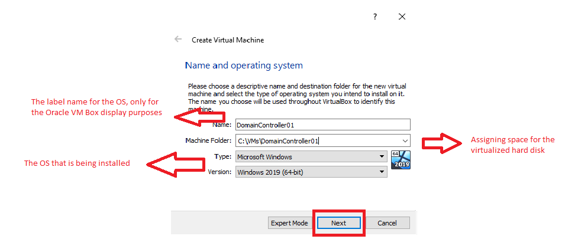

# Windows Server 2019 Installation
I am using Oracle VM Box as a virtualized space to install Windows Server 2019.  
https://www.virtualbox.org/

I have downloaded Windows Server 2019 ISO from Microsoft’s ‘Evaluation Center’, it’s a free product used for testing.
https://www.microsoft.com/en-us/evalcenter/evaluate-windows-server-2019

## The first step is deploying the Windows Server on Oracle VM Box

