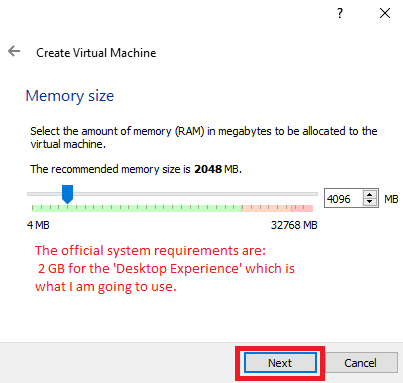
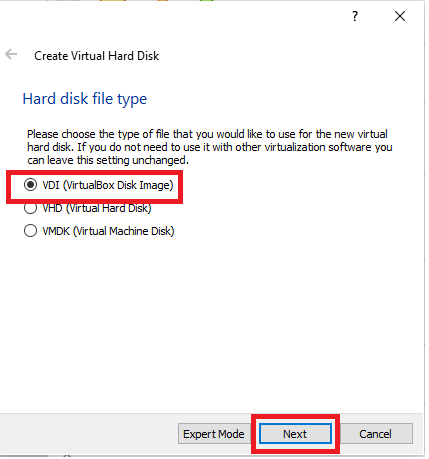
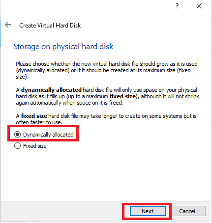
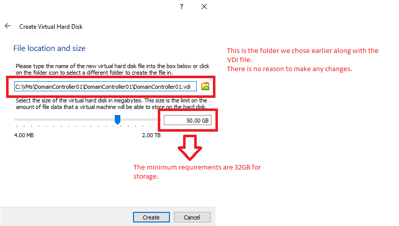
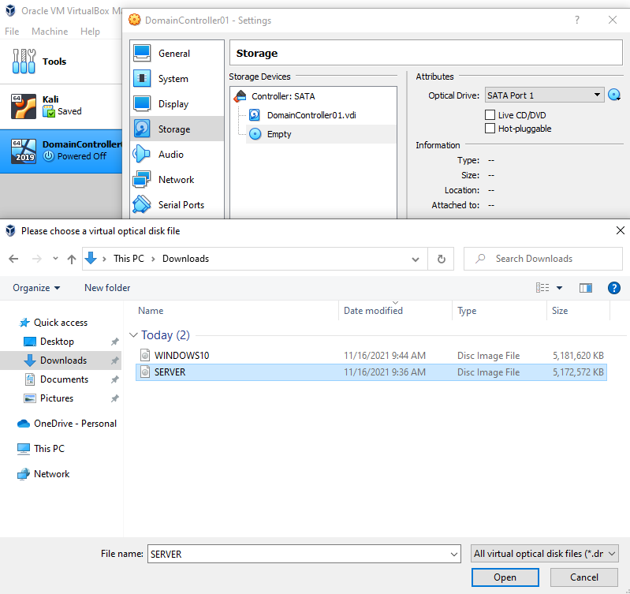

# Windows Server 2019 Installation
I am using Oracle VM Box as a virtualized space to install Windows Server 2019.  
https://www.virtualbox.org/

I have downloaded Windows Server 2019 ISO from Microsoft’s ‘Evaluation Center’, it’s a free product given for testing.
https://www.microsoft.com/en-us/evalcenter/evaluate-windows-server-2019

## The first step is deploying the Windows Server on Oracle VM Box

## Choosing the memory size for the OS

## Creating a virtual hard drive

## Choosing the hard disk type
VDI is the default disk format in Oracle VM Box, it supports Windows Server 2019 amongst other OSs. 

## Choosing either a dynamic or a fixed size hard disk
Dynamic hard disk is preferred as it allows for a maximum sized disk without assigning non required space.

## Placing the VDI file and choosing a maximum size for the disk

# Updating the virtual machine's settings

