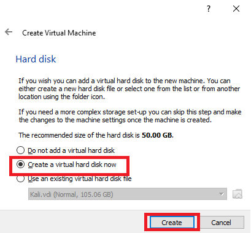
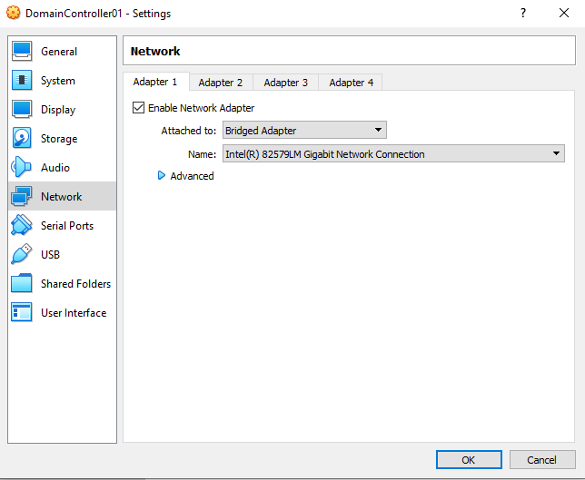
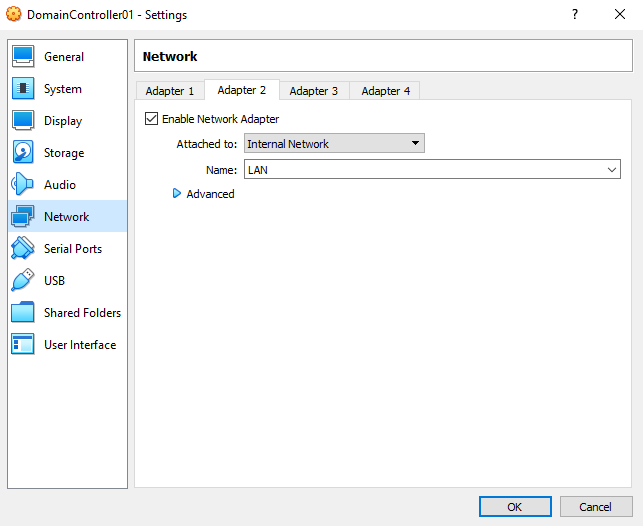
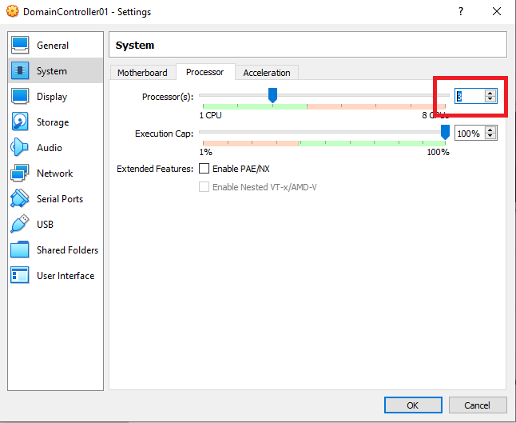

# Windows Server 2019 Installation
I am using Oracle VM VirtualBox as a virtualized space to install Windows Server 2019.  
https://www.virtualbox.org/

I have downloaded Windows Server 2019 ISO from Microsoft’s ‘Evaluation Center’, it’s a free product given for testing.
https://www.microsoft.com/en-us/evalcenter/evaluate-windows-server-2019

## The first step is deploying the Windows Server on Oracle VM VirtualBox

## Choosing the memory size for the OS

## Creating a virtual hard drive

## Choosing the hard disk type
VDI is the default disk format in Oracle VM Box, it supports Windows Server 2019 among other OSs. 

## Choosing a dynamic or a fixed size hard disk
Dynamic hard disk is preferred as it allows for a maximum sized disk without assigning non required space.

## Placing the VDI file and choosing a maximum size for the disk

# Updating the virtual machine's settings
### 'Storage' tab
Open the 'Storage' tab and click on the empty storage device (has a disk-shaped icon). Then, click on the disk-shaped icon on the right side and click 'Choose a disk file...' Insert the Windows Server ISO file.

### 'Network' tab
The network settings could be configured as the following:

### 'System' tab
It's advised to add more than one proccessor for a better experience.

